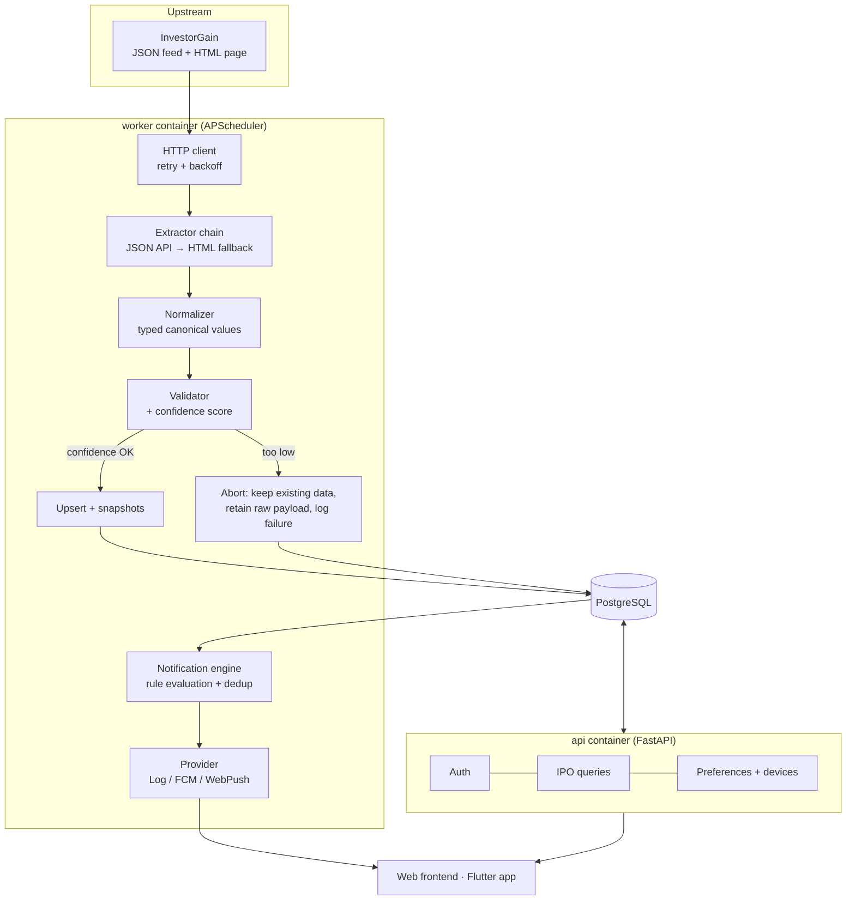

# IPO Tracker

Backend for tracking Indian IPOs, monitoring grey-market premium (GMP), and
delivering configurable IPO reminders to web and mobile clients.

REST API only — no UI. Designed to be consumed by a web frontend and a Flutter
app from the same versioned endpoints.

```bash
cp .env.example .env
docker compose up --build
```

That is the whole setup. The app connects to the PostgreSQL already running on
your machine, creates its database if missing, applies migrations itself, comes
up on <http://localhost:8000>, and scrapes IPO data within seconds of first boot.

---

## Contents

- [What it does](#what-it-does)
- [Architecture](#architecture)
- [Prerequisites](#prerequisites)
- [Quick start](#quick-start)
- [Configuration](#configuration)
- [API overview](#api-overview)
- [The notification rule](#the-notification-rule)
- [How the scraper stays resilient](#how-the-scraper-stays-resilient)
- [Testing](#testing)
- [Common tasks](#common-tasks)
- [Project layout](#project-layout)
- [Documentation](#documentation)

---

## What it does

1. **Scrapes** IPO and GMP data from InvestorGain three times a day, at a
   random moment inside each configured window.
2. **Normalises and validates** it into a typed PostgreSQL schema, tracking each
   IPO's identity separately from its values over time.
3. **Serves** it through a filterable, sortable, paginated REST API with JWT auth.
4. **Notifies** users when an IPO they care about is closing today and its GMP
   clears their threshold — at most once per configured interval, guaranteed.

### Major components

| Component | Location | Role |
| --- | --- | --- |
| API | `app/api/`, `app/main.py` | HTTP surface, auth, validation |
| Services | `app/services/` | Business logic (scraper, notifications, auth, IPO) |
| Repositories | `app/repositories/` | All database access, one place per aggregate |
| Models | `app/db/models/` | SQLAlchemy 2.x ORM schema |
| Workers | `app/workers/` | APScheduler process running the periodic jobs |

---

## Architecture



The API and the worker are separate containers sharing one image. A slow scrape
can never delay a request, and each scales independently.

### Key design decisions

**The upstream page is client-rendered.** `investorgain.com/report/ipo-gmp-live/331/`
is a Next.js app whose server HTML contains an *empty* table (`No data available`).
A plain HTML scrape returns zero rows. Rather than adding a headless browser
(~450 MB and seconds per scrape), the scraper calls the same JSON feed the
page's own JavaScript uses — which also exposes pre-parsed machine columns
(stable IPO id, ISO dates, plain decimals). The full resilient HTML parser is
kept as an automatic fallback and is exercised by fixture tests. See
[docs/scraper.md](docs/scraper.md).

**Status is derived, never stored.** An IPO's `UPCOMING`/`OPEN`/`CLOSING_TODAY`/
`CLOSED`/`LISTED` state is computed from its dates against today in
`APP_TIMEZONE`, as a SQL expression used for both filtering and responses. No
job has to run at midnight, and the value can never be stale.

**Deduplication is a database constraint, not a lock.** Notification windows are
bucketed into fixed intervals, and `notification_deliveries` is unique on
`(preference_id, ipo_id, period_key)`. Duplicate sends are impossible regardless
of worker count, restarts or scheduler overlap. No Redis, no queue.

**No Redis, no Celery.** The workload is a few cron-like jobs. APScheduler runs
them in-process; PostgreSQL advisory locks prevent overlap across replicas.
The stack is two containers — `api` and `worker` — against the PostgreSQL
already on the host.

**Scraping is randomised inside fixed windows.** Three runs a day (09:00, 14:00,
20:00 IST) each fire at a uniformly random moment in the following 30 minutes,
re-rolled daily, so the request pattern is not perfectly periodic. Because the
source only publishes the ~30 currently-live IPOs, every run is an **upsert**
keyed on the IPO's stable upstream id: existing rows are updated in place,
new IPOs are appended, and IPOs that have left the feed are retained — so the
historical pool builds itself over time.

---

## Prerequisites

- Docker 20.10+
- Docker Compose v2
- Git
- **PostgreSQL running on the host machine** (12+; tested on 18), reachable on
  `localhost:5432`

You do **not** need Python or any Python dependency installed locally —
including to run the tests.

The application connects to your local PostgreSQL as `postgres`/`postgres` and
**creates the `ipo_tracker` database itself** on first start, so there is still
no manual SQL. Change the credentials in `DATABASE_URL` if yours differ.

---

## Quick start

```bash
git clone <repository-url>
cd ipo-tracker

cp .env.example .env
# For production, generate a real secret:  openssl rand -hex 32
# and set it as JWT_SECRET_KEY in .env

docker compose up --build
```

What happens automatically:

```
migrate connects to your host PostgreSQL
      ↓  creates the `ipo_tracker` database if it does not exist
      ↓  runs `alembic upgrade head`, then exits
api starts on :8000        worker starts APScheduler
                                 ↓
                           first scrape immediately (only if the DB is empty)
                                 ↓
                           09:00-09:30 · 14:00-14:30 · 20:00-20:30 IST,
                           at a random moment inside each window
                           every NOTIFICATION_INTERVAL_MINUTES: rule evaluation
```

No manual database creation, table creation, or migration step is ever required.

Verify:

```bash
curl http://localhost:8000/health
curl "http://localhost:8000/api/v1/ipos?page_size=5"
open http://localhost:8000/docs
```

### Try it end to end

```bash
# Register (phone number is mandatory; any common format works)
curl -X POST http://localhost:8000/api/v1/auth/register \
  -H 'Content-Type: application/json' \
  -d '{"phone_number":"9876543210","password":"Str0ngPass1","name":"Asha"}'

# Log in
TOKEN=$(curl -s -X POST http://localhost:8000/api/v1/auth/login \
  -H 'Content-Type: application/json' \
  -d '{"phone_number":"9876543210","password":"Str0ngPass1"}' \
  | python -c 'import json,sys; print(json.load(sys.stdin)["access_token"])')

# "Alert me every 3 hours about IPOs closing today with GMP >= 15%"
curl -X POST http://localhost:8000/api/v1/notification-preferences \
  -H "Authorization: Bearer $TOKEN" -H 'Content-Type: application/json' \
  -d '{"min_gmp_percentage":15,"interval_minutes":180,"only_on_close_date":true}'

# Browse: SME IPOs closing this week, highest GMP first
curl "http://localhost:8000/api/v1/ipos?ipo_type=SME&close_date=this_week&sort_by=gmp_percentage&sort_order=desc"
```

---

## Configuration

Every setting is an environment variable, documented in
[`.env.example`](.env.example) and in [docs/deployment.md](docs/deployment.md).
The most important ones:

| Variable | Default | Purpose |
| --- | --- | --- |
| `APP_ENV` | `development` | `production` enables hardening checks and hides `/docs` |
| `APP_TIMEZONE` | `Asia/Kolkata` | Business timezone for **all** IPO date logic |
| `DATABASE_URL` | compose-provided | Must use the `postgresql+asyncpg://` driver |
| `JWT_SECRET_KEY` | placeholder | **Required.** App refuses to start in production with the default |
| `SCRAPER_ENABLED` | `true` | Turns the scrape job on/off |
| `SCRAPER_SCHEDULE_TIMES` | `09:00,14:00,20:00` | Daily scrape window start times, in `APP_TIMEZONE` |
| `SCRAPER_SCHEDULE_JITTER_MINUTES` | `30` | Each run fires at a random moment within this window |
| `SCRAPER_MIN_CONFIDENCE` | `0.5` | Below this, a scrape refuses to write |
| `NOTIFICATION_ENABLED` | `true` | Turns rule evaluation on/off |
| `NOTIFICATION_PROVIDER` | `log` | `log`, `fcm`, or `webpush` |
| `LOG_FORMAT` | `json` | `console` for readable local logs |

Secrets are never committed: `.env` is git-ignored, and only `.env.example`
(which contains placeholders) is tracked.

---

## API overview

Base path: `/api/v1`. Interactive docs at `/docs`, schema at `/openapi.json`.

| Method | Path | Auth | Purpose |
| --- | --- | --- | --- |
| `POST` | `/auth/register` | — | Create an account (phone + password) |
| `POST` | `/auth/login` | — | Obtain a JWT access token |
| `GET` | `/users/me` | ✅ | Current profile |
| `PATCH` | `/users/me` | ✅ | Update name/email |
| `GET` | `/ipos` | — | List with filters, search, sort, pagination |
| `GET` | `/ipos/filters` | — | Discover available filter values |
| `GET` | `/ipos/{id}` | — | Single IPO detail |
| `GET` | `/ipos/{id}/history` | ✅ | Recorded GMP/subscription changes |
| `GET`/`POST` | `/notification-preferences` | ✅ | List / create rules |
| `GET`/`PUT`/`DELETE` | `/notification-preferences/{id}` | ✅ | Manage one rule |
| `GET`/`POST` | `/devices` | ✅ | List / register push targets |
| `DELETE` | `/devices/{id}` | ✅ | Deregister a device |
| `GET` | `/notifications` | ✅ | Delivery history |

All filters compose. For example:

```
GET /api/v1/ipos?status=OPEN&ipo_type=SME&min_gmp_percentage=15
                &close_date_from=2026-09-01&close_date_to=2026-09-07
                &sort_by=gmp_percentage&sort_order=desc&page=1&page_size=20
```

Date filters accept an ISO date or a shortcut: `today`, `tomorrow`, `yesterday`,
`this_week`, `next_week`.

Errors always use one envelope:

```json
{"success": false, "error": {"code": "IPO_NOT_FOUND", "message": "IPO not found"}}
```

Switch on `error.code`; treat `error.message` as human-facing text. Full
reference: [docs/api.md](docs/api.md).

---

## The notification rule

A notification is delivered only when **every** condition holds:

```
IPO.close_date == today in APP_TIMEZONE     (unless only_on_close_date = false)
  AND  IPO.gmp_percentage >= rule.min_gmp_percentage
  AND  current time is inside the notification window
  AND  rule.interval_minutes has elapsed since the last alert for that IPO
  AND  no delivery already exists for this (rule, IPO, interval)
```

If the IPO is not closing today, **no notification is sent regardless of GMP**.

The last two conditions are one mechanism: time is bucketed into fixed windows
of the rule's interval, and the delivery table's unique constraint rejects a
second insert for the same bucket. Details in
[docs/notifications.md](docs/notifications.md).

---

## How the scraper stays resilient

The parser never depends on a CSS class, an element id, or a column position.
Columns are identified by *meaning*, in descending order of trust:

1. exact header label match,
2. token-subset match (`Close` matches `Close Date`, `IPO Close Dt`),
3. substring match,
4. **value-shape inference** — if the header is unrecognisable, the column's
   values are sampled and matched against the expected shape (all ISO dates,
   all `12.5x` multiples, …).

Each match carries a score; coverage of required fields plus row validity
produces a confidence score for the run. Below `SCRAPER_MIN_CONFIDENCE` the run
**refuses to write**, leaves existing IPO data untouched, retains the raw
payload, and records an observable failure.

The test suite proves this against six HTML variants — renamed CSS classes,
extra wrapper elements, reordered columns, a removed column, and a page that is
structurally unrecognisable (which must fail *safely*, not guess). See
[docs/scraper.md](docs/scraper.md).

---

## Testing

```bash
docker compose -f docker-compose.yml -f docker-compose.test.yml run --rm test
```

or, with `make`:

```bash
make test             # everything (273 tests)
make test-unit        # unit tests only, no database needed
make test-integration # integration tests only
make coverage         # with a coverage report
make lint             # ruff + mypy
```

Integration tests create and drop their own `ipo_tracker_test` database on your
host PostgreSQL, so they never touch development data. **No test contacts the
live InvestorGain site** — scraper tests replay saved fixtures in
`tests/fixtures/`.

---

## Common tasks

```bash
make up                      # start everything
make logs-worker             # watch scrapes and notifications
make schedule                # show the next fire time for every job
make scrape                  # trigger one scrape immediately
make notify                  # trigger one rule evaluation immediately
make psql                    # open a shell on the host database
make migration m="add xyz"   # autogenerate a migration
make down                    # stop (host database untouched)
make clean                   # stop and DROP the ipo_tracker database
```

Without `make`, each recipe's underlying `docker compose` command is listed in
the [Makefile](Makefile).

---

## Project layout

```
ipo-tracker/
├── app/
│   ├── main.py                  FastAPI app factory
│   ├── api/
│   │   ├── deps.py              session + current-user dependencies
│   │   └── v1/                  auth, users, ipos, notifications routes
│   ├── core/                    config, security, logging, errors, middleware
│   ├── db/
│   │   ├── models/              users, ipos, snapshots, notifications, devices, scrape runs
│   │   ├── base.py              declarative base + mixins
│   │   └── session.py           async engine and session factory
│   ├── repositories/            all database access
│   ├── schemas/                 Pydantic request/response models
│   ├── services/
│   │   ├── auth.py  ipo.py
│   │   ├── scraper/             client, extractor, field_map, normalizer, validator, pipeline
│   │   └── notifications/       engine, providers, service
│   ├── workers/                 scheduler + job entrypoints
│   └── utils/                   date and parsing helpers
├── alembic/versions/            migrations
├── tests/{unit,integration,fixtures}/
├── docs/                        architecture, api, scraper, notifications, database, deployment, development
├── Dockerfile                   multi-stage: `runtime` (prod) and `test` targets
├── docker-compose.yml  docker-compose.test.yml
├── requirements.txt  pyproject.toml  Makefile
└── .env.example
```

---

## Documentation

| Document | Contents |
| --- | --- |
| [docs/architecture.md](docs/architecture.md) | Layering, request flow, scalability, error handling, idempotency |
| [docs/api.md](docs/api.md) | Every endpoint: parameters, bodies, responses, errors, examples |
| [docs/scraper.md](docs/scraper.md) | Extraction strategies, resilience, confidence, adding fields |
| [docs/notifications.md](docs/notifications.md) | Rule model, eligibility, deduplication, providers, FCM/Flutter |
| [docs/database.md](docs/database.md) | Tables, relationships, indexes, JSONB usage, migrations |
| [docs/deployment.md](docs/deployment.md) | Docker services, env vars, scaling, backups, graceful shutdown |
| [docs/development.md](docs/development.md) | Adding endpoints, models, migrations, scraper fields, providers |

---

## License

MIT
