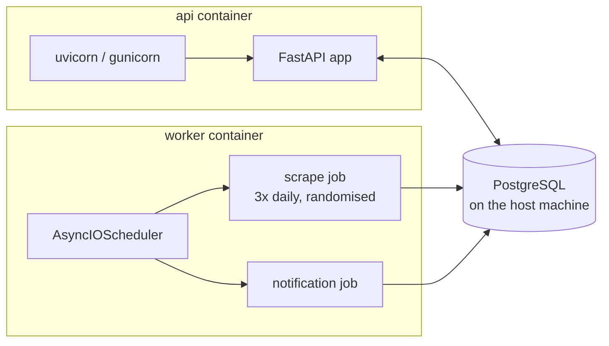
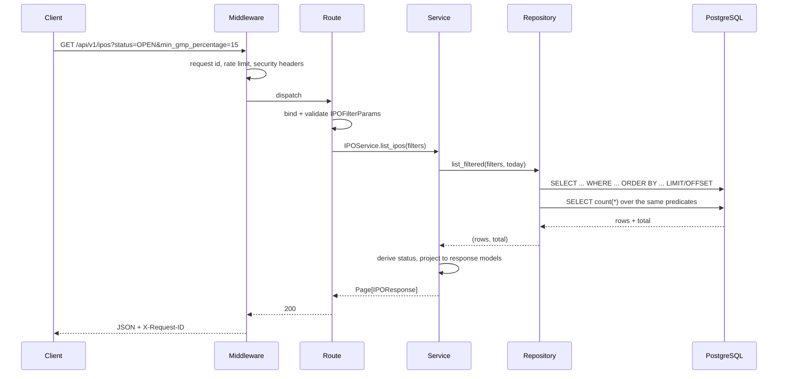
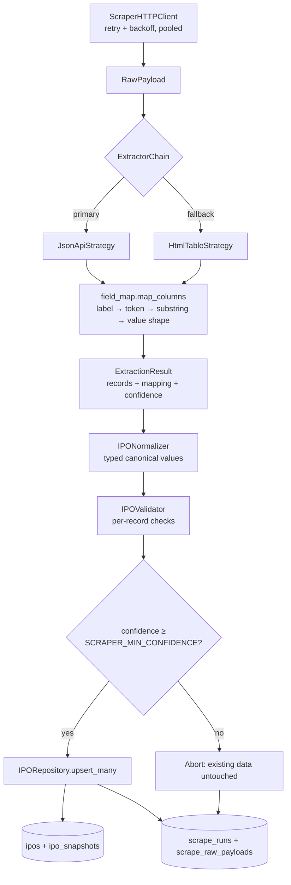
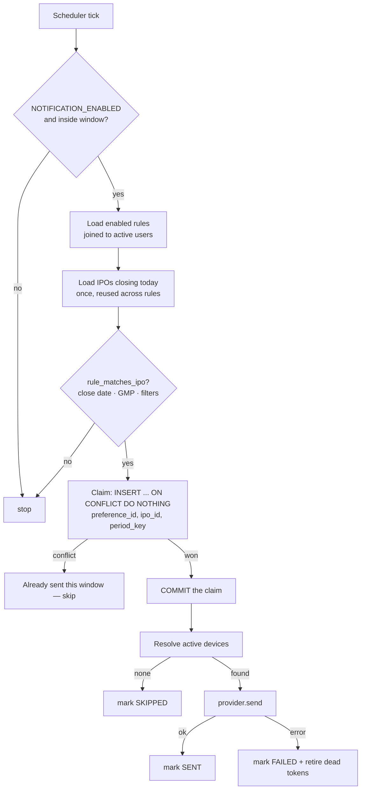
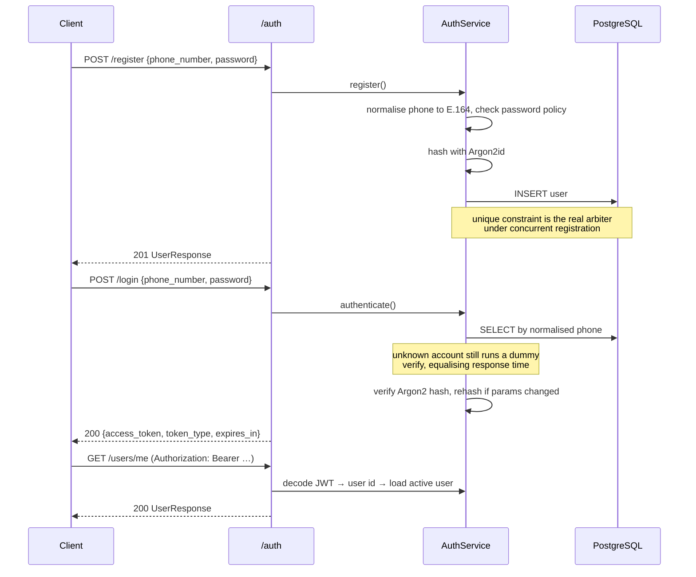
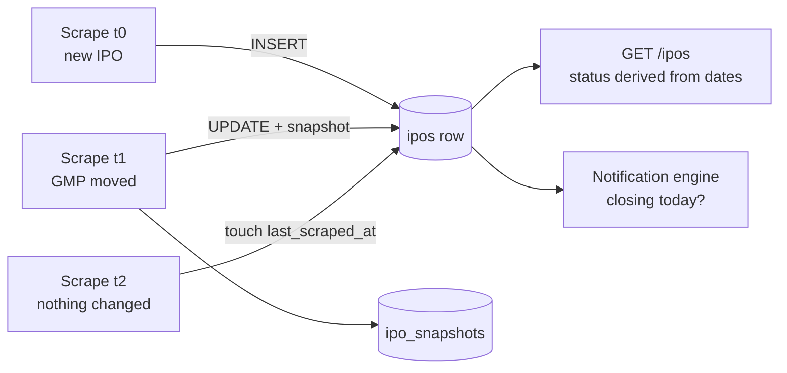

# Architecture

## Layering

Dependencies point in one direction. A layer may call the one below it, never
the one above.

```
   HTTP request
        ↓
┌───────────────────────────────────────────────────────────┐
│ app/api/          routes, dependencies                    │  no business logic,
│                                                           │  no SQL
├───────────────────────────────────────────────────────────┤
│ app/schemas/      Pydantic request/response models        │  validation, docs
├───────────────────────────────────────────────────────────┤
│ app/services/     business logic                          │  no SQL, no HTTP
├───────────────────────────────────────────────────────────┤
│ app/repositories/ all database access                     │  no scraping,
│                                                           │  no HTTP
├───────────────────────────────────────────────────────────┤
│ app/db/models/    SQLAlchemy ORM                          │
└───────────────────────────────────────────────────────────┘
        ↓
   PostgreSQL
```

`app/core/` (config, security, logging, errors, middleware) and `app/utils/`
(date and parsing helpers) are cross-cutting and may be imported anywhere.

Rules the codebase holds to:

- Route handlers contain no business logic and issue no queries — they bind
  validated input to a service call.
- Repositories contain no scraping or HTTP logic.
- The scraper package never imports from `app/api/`.
- Nothing outside `app/core/config.py` reads `os.environ`.

### One circular-import trap, deliberately avoided

`app/services/scraper/__init__.py` re-exports **nothing**. `pipeline.py` depends
on the repository layer, and the repository layer depends on `models.py` for its
DTOs; eagerly importing the pipeline in the package `__init__` closes that loop.
Submodules are imported directly instead.

---

## Processes

Two containers run from one image, so their dependency sets can never drift.



PostgreSQL is not containerised; both services reach the host instance through
`host.docker.internal`.

Scraping and notification evaluation never run inside the API process, so a slow
upstream fetch cannot add latency to a request.

---

## Request flow



Middleware order (registered last runs outermost):

1. `RequestContextMiddleware` — request id, timing, completion log
2. `SecurityHeadersMiddleware` — nosniff, frame options, CSP, HSTS in production
3. `RateLimitMiddleware` — fixed-window limit on credential endpoints
4. `CORSMiddleware` — only when `CORS_ORIGINS` is set

---

## Scraper architecture



Every stage passes a plain dataclass to the next, so each is unit-testable with
no database and no network. Full detail: [scraper.md](scraper.md).

---

## Notification architecture



The claim is committed **before** the provider is called, so a crash mid-send
cannot produce a duplicate on the next run. Detail:
[notifications.md](notifications.md).

---

## Authentication flow



Tokens are stateless HS256 JWTs carrying `sub`, `type`, `iat`, `exp`, `iss` and
`jti`. The `jti` claim exists so a revocation list can be added later without a
token-format change. Refresh tokens, OTP login and phone verification all belong
in `AuthService` and need no change to the HTTP layer.

---

## Data flow over an IPO's life



`ipos` holds one row per IPO forever, keyed on `(source, source_ipo_id)`.
Repeated scrapes update in place; a snapshot is appended only when a tracked
value actually changed, so `ipo_snapshots` grows with market activity rather
than with scrape frequency.

---

## Idempotency

Three independent mechanisms, each matched to its failure mode:

| Concern | Mechanism | Why this one |
| --- | --- | --- |
| Duplicate IPO rows | `UNIQUE (source, source_ipo_id)` + upsert | Identity is stable upstream; the constraint makes duplication impossible |
| Duplicate notifications | `UNIQUE (preference_id, ipo_id, period_key)` | Survives concurrent workers, restarts and transaction retries with no lock |
| Overlapping job runs | PostgreSQL advisory locks | Session-scoped: released automatically if the process dies, so a crash cannot wedge the job |

Advisory locks prevent *wasted work*; the unique constraints prevent *wrong
results*. The system stays correct even if the locks are removed.

---

## Error handling

Every deliberate failure derives from `AppError` and carries a stable `code`.
`app/core/errors.py` registers handlers for:

| Exception | Response |
| --- | --- |
| `AppError` subclasses | Their own status and code |
| `RequestValidationError` | `422 VALIDATION_ERROR` with per-field details |
| `StarletteHTTPException` | Normalised into the shared envelope |
| `IntegrityError` | `409 CONFLICT`, SQL never exposed |
| `SQLAlchemyError` | `503 DATABASE_UNAVAILABLE`, logged with traceback |
| Anything else | `500 INTERNAL_ERROR`, logged with traceback |

Clients always receive:

```json
{"success": false, "error": {"code": "…", "message": "…", "details": {…}}}
```

Stack traces, SQL and driver messages are logged internally and never returned.

---

## Scalability

The API is stateless: no session affinity, no in-process caches that affect
correctness. Multiple replicas can sit behind a load balancer immediately.

```bash
docker compose up -d --scale api=4
```

| Concern | Current approach | When it needs changing |
| --- | --- | --- |
| API throughput | Stateless replicas; gunicorn + uvicorn workers in production | — |
| Worker duplication | Advisory locks + unique constraints make replicas safe | — |
| Database connections | Per-container pool (`DB_POOL_SIZE` + overflow) | Add PgBouncer past ~100 total connections |
| Rate limiting | In-process, therefore **per container** | Enforce at the ingress/load balancer for a global limit |
| Query cost | Every filter is SQL; only one page is materialised | — |
| N+1 queries | Rules joined to users in one query; IPOs closing today loaded once and reused across rules | — |
| Snapshot growth | Written only on real change | Partition or roll up `ipo_snapshots` if retention grows |
| Raw payloads | Retained per policy, pruned on a schedule | Move to object storage if `always` retention is needed long-term |

### Performance choices already made

- Async end to end: FastAPI, SQLAlchemy async, asyncpg, httpx.
- One pooled `httpx.AsyncClient` reused across scrapes (TLS handshakes amortised).
- `pool_pre_ping` so a connection dropped by the server reconnects instead of 500ing.
- Composite index `(close_date, gmp_percentage)` serving the notification query.
- GIN + `pg_trgm` index backing `?search=`.
- Bulk upsert: one `SELECT` for existing rows regardless of batch size.
- `eager_defaults` so server-generated timestamps come back via `RETURNING`
  rather than a second round trip.
