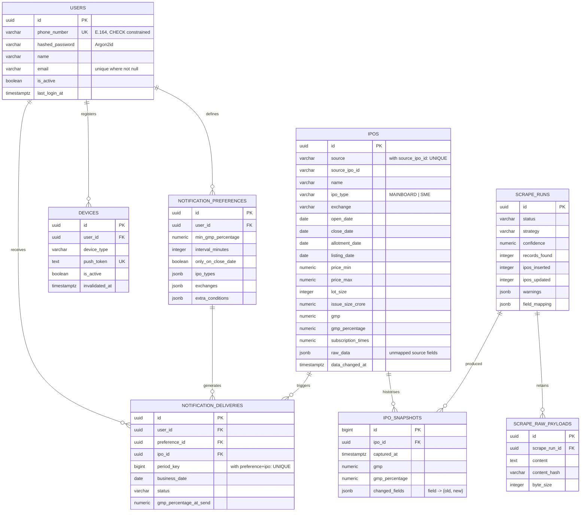

# Database

PostgreSQL 16. Async access through SQLAlchemy 2.x + asyncpg. Schema managed
entirely by Alembic — there is no manual DDL step at any point.

## Entity relationships



---

## IPO identity vs. IPO data over time

The most important modelling decision here.

**`ipos` — identity.** One row per IPO, for its whole life. Keyed on
`UNIQUE (source, source_ipo_id)`, where `source_ipo_id` is the upstream's own
stable numeric id. Repeated scrapes update this row in place, so GMP moving from
₹25 to ₹44 never creates a second Deepa Jewellers.

Identity resolution degrades gracefully if the id column disappears:

1. the explicit id column, else
2. the numeric id embedded in the detail URL (`/gmp/deepa-jewellers-ipo/2081/`), else
3. a slug of the name (`name:deepa-jewellers`).

**`ipo_snapshots` — history.** A row is appended only when a *tracked* field
actually changes, so the table grows with market activity rather than with
scrape frequency. `changed_fields` records exactly what moved:

```json
{"gmp": {"old": 25.0, "new": 44.0}, "gmp_percentage": {"old": 14.1, "new": 24.86}}
```

`BIGINT` identity keys keep the highest-volume table compact.

**Blank-value protection.** The upstream intermittently blanks cells (an IPO
announced before its schedule is published). A newly-`NULL` value is treated as
"no new information" and ignored, so good data is never erased and the snapshot
table is not filled with noise. `raw_data` is merged, never replaced, for the
same reason.

---

## Columns vs. JSONB

| Use a **column** when the field is… | Use **`raw_data` JSONB** when… |
| --- | --- |
| filtered (`gmp_percentage`, `close_date`) | it has no canonical home yet |
| sorted (`issue_size_crore`, `lot_size`) | it is display-only |
| indexed | it may disappear upstream |
| relationally joined | it is newly published and unproven |

`raw_data` exists so a newly-added upstream column is captured from the very
first scrape rather than discarded — it can be promoted to a real column later
without back-filling from the source. It is deliberately **not** used for
anything queried; `docs/scraper.md` covers the promotion steps.

JSONB is also used for genuinely list-shaped, non-indexed configuration:
`notification_preferences.ipo_types` / `.exchanges` / `.channels` /
`.extra_conditions`, and `scrape_runs.warnings` / `.field_mapping`.

---

## Indexes

Every index is justified by a real query; nothing is indexed speculatively.

| Index | Table | Serves |
| --- | --- | --- |
| `ix_ipos_close_date_gmp_percentage` | ipos | **The notification hot path** — "closing today with GMP ≥ X" |
| `ix_ipos_ipo_type_close_date` | ipos | "SME issues closing this week" |
| `ix_ipos_open_date`, `ix_ipos_listing_date` | ipos | Date-range filters |
| `ix_ipos_gmp_percentage` | ipos | GMP filter and default sort |
| `ix_ipos_exchange` | ipos | Exchange filter |
| `ix_ipos_name_trgm` (GIN, `pg_trgm`) | ipos | `?search=` substring matching |
| `uq_ipos_source_source_ipo_id` | ipos | Identity; drives the upsert |
| `ix_ipo_snapshots_ipo_id_captured_at` | ipo_snapshots | History for one IPO, newest first |
| `uq_notification_delivery_period` | notification_deliveries | **The dedup guarantee** |
| `ix_notification_deliveries_user_id_created_at` | notification_deliveries | History endpoint |
| `ix_notification_preferences_enabled` (partial) | notification_preferences | Worker loads only enabled rules |
| `ix_devices_user_id_active` (partial) | devices | Worker loads only active devices |
| `uq_users_email` (partial) | users | Uniqueness only where an email exists |
| `ix_scrape_runs_started_at_status` | scrape_runs | Recent-runs dashboard query |

Partial indexes (`WHERE is_enabled`, `WHERE is_active`, `WHERE email IS NOT NULL`)
stay small because they only cover the rows actually queried.

**`pg_trgm`** is created by the initial migration
(`CREATE EXTENSION IF NOT EXISTS pg_trgm`), so no manual database setup is
required. It is deliberately not dropped on downgrade — other schemas may rely
on it.

---

## Constraints

| Constraint | Table | Prevents |
| --- | --- | --- |
| `phone_number ~ '^\+[1-9][0-9]{6,17}$'` | users | Non-E.164 numbers reaching the login identity |
| `UNIQUE (source, source_ipo_id)` | ipos | Duplicate IPO identities |
| `price_min <= price_max` | ipos | Inverted price bands |
| `open_date <= close_date` | ipos | Swapped date columns (caught in tests) |
| `lot_size > 0` | ipos | Nonsense lot sizes |
| `confidence BETWEEN 0 AND 1` | scrape_runs | Out-of-range scores |
| `interval_minutes BETWEEN 15 AND 10080` | notification_preferences | Notification spam, and absurd `period_key` arithmetic |
| `max_gmp_percentage >= min_gmp_percentage` | notification_preferences | Unsatisfiable rules |
| `UNIQUE (preference_id, ipo_id, period_key)` | notification_deliveries | Duplicate notifications |
| `UNIQUE (push_token)` | devices | The same token owned by two accounts |

All foreign keys use `ON DELETE CASCADE`, except `ipo_snapshots.scrape_run_id`
which is `SET NULL` — deleting an old run must not destroy price history.

---

## Timestamps and timezones

- Every timestamp column is `TIMESTAMPTZ` and stored in **UTC**.
- Server-side `now()` defaults, so rows written outside the ORM are stamped too.
- `eager_defaults` on the declarative base fetches server-generated values via
  `RETURNING` in the same statement — without it, reading `updated_at` after a
  commit triggers a lazy refresh that raises `MissingGreenlet` under async.
- **Business dates** (`open_date`, `close_date`, `business_date`) are `DATE` and
  are always compared against today in `APP_TIMEZONE`, never the server's local
  timezone. Conversion is centralised in `app/utils/dates.py`.

---

## Derived status

IPO status is **never stored**. It is computed from the dates against today:

```sql
CASE
  WHEN listing_date IS NOT NULL AND listing_date <= :today THEN 'LISTED'
  WHEN close_date   IS NOT NULL AND close_date   =  :today THEN 'CLOSING_TODAY'
  WHEN close_date   IS NOT NULL AND close_date   <  :today THEN 'CLOSED'
  WHEN open_date    IS NOT NULL AND open_date   <= :today
       AND (close_date IS NULL OR close_date >= :today)     THEN 'OPEN'
  WHEN open_date    IS NOT NULL AND open_date    >  :today THEN 'UPCOMING'
  ELSE 'UNKNOWN'
END
```

Branch order matters: "listed" outranks "closed", and "closing today" outranks
"open". The same logic exists twice — as a SQL expression
(`ipo_status_expression`) for filtering, and in Python (`derive_status`) for
response bodies. An integration test asserts the two agree.

No midnight job is needed, and the value can never be stale.

---

## Migrations

```bash
# Applied automatically on every `docker compose up` by the `migrate` service.
make migrate

# Create a new one after changing models
make migration m="add ipos.sector"
```

The `migrate` service is a one-shot container; `api` and `worker` wait on
`service_completed_successfully`, so replicas never race on schema changes.

Alembic runs over the same asyncpg driver the application uses
(`alembic/env.py`), which keeps a second PostgreSQL driver out of the image. The
URL comes from application settings, so credentials live in exactly one place
and are never written into `alembic.ini`.

Constraint and index names come from an explicit naming convention on
`Base.metadata`, so autogenerated migrations are stable and reversible instead
of depending on database-assigned names.

Review every autogenerated migration before committing — Alembic cannot infer
data migrations, and it will happily emit a destructive `DROP` for a rename.

---

## Inspecting the database

```bash
make psql
```

```sql
\dt                                  -- tables
\d+ ipos                             -- one table in full
SELECT count(*) FROM ipos;

-- Recent scrape health
SELECT started_at, status, strategy, confidence,
       records_found, ipos_inserted, ipos_updated, error_code
FROM scrape_runs ORDER BY started_at DESC LIMIT 10;

-- GMP movement for one IPO
SELECT captured_at, gmp, gmp_percentage, changed_fields
FROM ipo_snapshots
WHERE ipo_id = (SELECT id FROM ipos WHERE name ILIKE '%deepa%')
ORDER BY captured_at DESC;

-- Index usage, to confirm the indexes above earn their keep
SELECT relname, indexrelname, idx_scan
FROM pg_stat_user_indexes ORDER BY idx_scan DESC;
```
