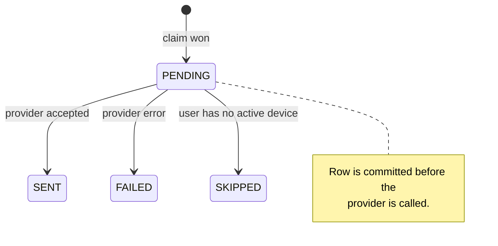

# Notifications

## The core rule

A notification is delivered only when **every** condition holds:

```
IPO.close_date == today in APP_TIMEZONE      (unless only_on_close_date = false)
  AND  IPO.gmp_percentage >= rule.min_gmp_percentage
  AND  (rule.max_gmp_percentage is unset OR gmp_percentage <= it)
  AND  current hour is inside the notification window
  AND  rule.interval_minutes has elapsed since the last alert for that IPO
  AND  no delivery already exists for this (rule, IPO, interval)
```

**If `close_date != today`, no notification is sent regardless of how high the
GMP is.** That restriction is checked first, in `rule_matches_ipo()`
(`app/services/notifications/engine.py`), and is covered by explicit tests.

### Worked example

User rule:

```json
{"min_gmp_percentage": 15, "interval_minutes": 180, "only_on_close_date": true}
```

| IPO | close_date | gmp % | Result |
| --- | --- | --- | --- |
| ESDS Software | today | 63.40 | ✅ sent, then at most once per 3 h |
| Paluck Technologies | today | 41.67 | ✅ sent |
| Farm Peace | today | 0.00 | ❌ below threshold |
| Veegaland Developers | in 14 days | 12.86 | ❌ not closing today |
| Any IPO | tomorrow | 500.00 | ❌ not closing today |

---

## The rule model

One user may hold many rules; each is evaluated independently. Stored in
`notification_preferences`.

| Field | Type | Default | Meaning |
| --- | --- | --- | --- |
| `label` | text | `null` | Your own name for the rule |
| `is_enabled` | bool | `true` | Disabled rules are not evaluated at all |
| `min_gmp_percentage` | numeric | `0` | Inclusive lower bound |
| `max_gmp_percentage` | numeric | `null` | Optional inclusive upper bound |
| `interval_minutes` | int | `180` | Minimum gap between alerts for one IPO; also the dedup window (15 min – 7 days) |
| `only_on_close_date` | bool | `true` | The headline restriction; opt out deliberately |
| `ipo_types` | jsonb | `null` | Restrict to `MAINBOARD` / `SME`; null or empty = all |
| `exchanges` | jsonb | `null` | Restrict to `NSE`, `BSE`, `NSE_SME`, `BSE_SME`, `NSE_BSE`; null or empty = all |
| `min_subscription_times` | numeric | `null` | Optional demand floor |
| `channels` | jsonb | `["PUSH"]` | Delivery channels |
| `extra_conditions` | jsonb | `{}` | Forward-compatible criteria store |

**Extensibility.** Criteria that are filtered on every evaluation are real
columns, so the worker can narrow in SQL. Open-ended future criteria go in
`extra_conditions`, which means a new condition can be accepted by the API and
stored without a migration. Once a condition proves worth indexing, promote it
to a column and add one clause to `rule_matches_ipo()`.

---

## Deduplication

This is the part worth understanding, because it is what makes the worker safe
to run anywhere.

Wall-clock time is bucketed into fixed windows of the rule's own interval:

```python
period_key = int(utc_timestamp) // (interval_minutes * 60)
```

Every worker run inside the same window computes an **identical** key, and the
key is timezone-independent (it is derived from the UTC epoch).

`notification_deliveries` then carries:

```sql
UNIQUE (preference_id, ipo_id, period_key)
```

A send is claimed with a single atomic statement:

```sql
INSERT INTO notification_deliveries (...) VALUES (...)
ON CONFLICT ON CONSTRAINT uq_notification_delivery_period DO NOTHING
RETURNING id;
```

Whichever caller gets a row back owns the send; everyone else gets `NULL` and
backs off. Because it is one statement, concurrent workers cannot both win.

This holds against **all** of:

| Scenario | Outcome |
| --- | --- |
| Scheduler fires every 15 min, rule interval is 3 h | 1 send per 3 h; 11 runs skip as duplicates |
| Several worker replicas racing | Exactly one insert succeeds |
| Worker restarts mid-window | Claim already exists; no resend |
| Scrape runs repeatedly | Irrelevant — dedup keys off the rule and window, not the scrape |
| Transaction retried | Constraint rejects the second attempt |

The claim is written and **committed before the provider is called**, so a crash
during delivery cannot produce a duplicate on the next run. The cost of that
ordering is that a crash mid-send may lose one notification rather than sending
two — the right trade for alerting.

Advisory locks in `app/workers/notification_worker.py` additionally stop two
runs doing the same evaluation work, but they are an optimisation: correctness
comes from the constraint.

---

## Delivery lifecycle



`notification_deliveries` also records `gmp_percentage_at_send` and a payload
snapshot, so history stays meaningful after the IPO row moves on.

---

## Quiet hours

Evaluation is skipped entirely outside
`[NOTIFICATION_WINDOW_START_HOUR, NOTIFICATION_WINDOW_END_HOUR)`, measured in
`APP_TIMEZONE` (default 08:00–22:00 IST). Nothing is claimed or queued during
quiet hours — the alert is simply not raised for that window.

---

## Devices

Push targets live in `devices`:

| Field | Notes |
| --- | --- |
| `user_id` | Owner |
| `device_type` | `ANDROID`, `IOS`, `WEB` |
| `push_token` | Provider-issued; **globally unique**, never logged or returned |
| `is_active` | Cleared on deregistration or when a provider reports the token dead |
| `invalidated_at` | Set when permanently rejected, so it is not retried forever |

**Re-registration is idempotent.** Providers reassign a token when an app is
reinstalled or restored onto another device, so registering an existing token
*moves* it to the calling user and reactivates it rather than failing on the
unique constraint.

Channel-to-platform routing: `WEBPUSH` targets `WEB` devices; `PUSH` targets
`ANDROID` and `IOS`. A user with no matching active device produces a `SKIPPED`
delivery — recorded, not silently dropped.

---

## Provider architecture

```
NotificationEngine
        │  (knows only this interface)
        ▼
NotificationProvider
    ├── LogProvider      default — records instead of transmitting
    ├── FCMProvider      Android / iOS / Flutter, via FCM HTTP v1
    └── WebPushProvider  browsers, via VAPID
```

```python
class NotificationProvider(ABC):
    name: str
    channel: NotificationChannel

    @property
    def is_configured(self) -> bool: ...
    async def send(self, message: NotificationMessage,
                   targets: list[DeviceTarget]) -> SendResult: ...
```

`SendResult` reports success, a provider message id, an error, and
`invalid_tokens` — tokens the provider declared permanently dead, which the
engine then retires.

### Why `log` is the default

`LogProvider` needs no credentials, so the entire pipeline — rule evaluation,
claiming, the delivery ledger, device routing — runs and is testable end to end
before any push credentials exist. Switching to a real transport is an
environment-variable change:

```env
NOTIFICATION_PROVIDER=fcm
```

An unconfigured provider falls back to `LogProvider` with a warning rather than
taking the worker down.

### Firebase Cloud Messaging (Flutter, Android, iOS)

```env
NOTIFICATION_PROVIDER=fcm
FCM_CREDENTIALS_FILE=/run/secrets/firebase-service-account.json
FCM_PROJECT_ID=your-firebase-project-id
```

The `google-auth` dependency is **not** in the base image — it is imported
lazily inside `send()` so it is only required when FCM is actually selected:

```bash
pip install "ipo-tracker[fcm]"
```

Flutter integration:

1. Client obtains its FCM token via `firebase_messaging`.
2. Client `POST`s it to `/api/v1/devices` with `device_type: ANDROID` or `IOS`.
3. Worker sends via FCM HTTP v1 to that token.
4. On token refresh, the client re-registers; the backend reassigns it.

The `data` payload is all strings (FCM rejects non-string values) and carries
`ipo_id`, `ipo_name`, `gmp_percentage`, `close_date`, `preference_id` and
`type: "ipo_gmp_alert"` — enough to deep-link straight to the IPO screen.

### Web Push

```env
NOTIFICATION_PROVIDER=webpush
VAPID_PUBLIC_KEY=…
VAPID_PRIVATE_KEY=…
VAPID_SUBJECT=mailto:admin@example.com
```

Requires `pip install "ipo-tracker[webpush]"`. The browser's `PushManager`
subscription JSON is stored as the device's `push_token`.

### Adding a provider

1. Subclass `NotificationProvider` in `app/services/notifications/providers.py`.
2. Implement `is_configured` and `send`; import any third-party client lazily.
3. Register it in `_PROVIDERS`.
4. Add its name to `NotificationProviderName` in `app/core/config.py` and, if it
   is a new transport, to `NotificationChannel`.

Nothing in the engine, the routes or the database changes.

---

## Failure handling

| Failure | Behaviour |
| --- | --- |
| Provider raises | Delivery marked `FAILED` with the error; the pass continues to the next |
| Provider rejects a token permanently | Device deactivated, `invalidated_at` set |
| User has no active device | Delivery marked `SKIPPED` with a reason |
| Provider not configured | Falls back to `LogProvider` with a warning |
| Whole evaluation errors | Logged with a traceback; the scheduler survives |

There is deliberately **no automatic retry** of a failed delivery: an IPO alert
is time-sensitive, and re-sending a stale one is worse than dropping it. The
next interval produces a fresh evaluation with current data.

---

## Observability

Structured events, all free of tokens and personal data:

| Event | Fields |
| --- | --- |
| `notification.evaluation_completed` | rules, ipos, matches, claimed, duplicates_skipped, sent, failed, skipped_no_device |
| `notification.dispatched` | provider, title, target_count, device_types, ipo_id |
| `notification.outside_window` | hour, window_start, window_end |
| `notification.send_failed` | delivery_id, reason |
| `notification.provider_not_configured` | requested_provider, using |

```bash
docker compose logs -f worker | grep notification
```

```sql
-- Recent deliveries
SELECT i.name, d.status, d.business_date, d.gmp_percentage_at_send, d.sent_at
FROM notification_deliveries d JOIN ipos i ON i.id = d.ipo_id
ORDER BY d.created_at DESC LIMIT 20;
```

---

## Manual testing

```bash
# Force one evaluation now
make notify

# Open the quiet-hours window for a one-off run
docker compose exec -e NOTIFICATION_WINDOW_END_HOUR=24 worker \
  python -m app.workers.run_once notify
```

Running it twice in the same interval should report
`claimed=0 duplicates_skipped=N sent=0` the second time — that is the dedup
guarantee visible in the logs.
